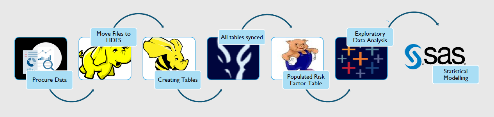

# Truck Fleet Risk Analysis - Big Data Analytics Project

## 🚛 Project Overview

This big data analytics project analyzes truck fleet data to identify risk factors, dangerous driving patterns, and provide actionable insights for minimizing traffic accidents and improving fleet safety. The analysis covers driver behavior, geographical risk assessment, truck model performance, and predictive modeling using big data technologies.

## 🎯 Problem Statement

Truck-related traffic accidents are a major source of fatalities and injuries. A trucking business has committed to analyzing fleet data and implementing appropriate damage-minimization strategies to solve this critical safety problem.

## 📊 Project Objectives

### 1. **Driver Analysis**
- Identify the most dangerous drivers based on overspeeding, lane deviation, and unsafe following distances
- Rank drivers by risk factors and violation patterns

### 2. **Geographical Analysis** 
- Evaluate relative risk levels of California's riskiest cities
- Compare regional risk patterns to determine high-risk zones

### 3. **Truck Model Analysis**
- Evaluate and compare truck models using average risk factors and event counts
- Identify safest and most dangerous vehicle models

### 4. **Driving Incident Analysis**
- Analyze factors related to driving events and violations
- Identify patterns in incident types and locations

### 5. **Mileage/Speed Analysis**
- Categorize drivers into high and low-risk groups
- Analyze relationships between total miles, maximum speed, and average mileage

### 6. **Predictive Modeling**
- Develop linear regression models to predict driver risk factors
- Identify significant variables influencing driver safety

## 🔧 Methodology & Big Data Pipeline

The analysis follows a comprehensive big data processing pipeline:

### Technologies Used:
- **Hadoop HDFS**: Distributed file storage for large datasets
- **Big Data Processing**: Data ingestion and transformation
- **Statistical Analysis**: Risk factor calculations and modeling
- **Data Visualization**: Geographic and trend analysis
- **Machine Learning**: Linear regression for predictive modeling

## 📈 Key Findings

### 🚨 Driver Risk Analysis
- **Highest Risk Driver**: Driver A97 with risk factor of 31.69
- **Most Common Violation**: Lane departure (committed by almost all risky drivers)
- **Critical Insight**: Personalized training needed based on individual violation patterns

### 🗺️ Geographical Risk Assessment
- **Highest Risk City**: Santa Rosa, CA (53 violations)
- **Second Highest**: Willits, CA (28 violations)
- **Regional Pattern**: Most violations concentrated in northwestern California
- **Risk Distribution**: Clear geographic clustering of high-risk areas

### 🚚 Truck Model Performance
- **Highest Risk Model**: Oshkosh (average risk factor: 10.45)
- **Lowest Risk Model**: Navistar (average risk factor: 5.862)
- **Most Violations**: Ford model involved in bulk of infractions
- **Best Performer**: Crane model with extremely few infractions

### 🚦 Driving Incident Breakdown
**Santa Rosa (Highest Risk City) Incidents:**
- Lane Departure: 15 incidents
- Overspeed: 11 incidents  
- Unsafe Following Distance: 15 incidents
- Unsafe Tail Distance: 12 incidents

**Overall Incident Distribution:**
- Lane Departures: 33.33% of incidents
- Unsafe Following Distances: 32.80% of incidents

**Top 5 High-Risk Drivers**: A35, A43, A92, A94, A11

### 📊 Mileage/Speed Risk Correlation
**High-Risk Driver Patterns:**
- **Total Miles**: 620,000 - 680,000 miles
- **Maximum Speed**: 70 - 95 mph
- **Average Mileage**: 4.5 - 6.0 MPG

**Important Note**: Many low-risk drivers also fell into similar ranges, indicating complexity in risk assessment.

## 🤖 Predictive Modeling Results

### Linear Regression Model Performance
**Significant Variables** (p-value < 0.05):
- Events
- Total Miles  
- Truck Model

### Key Model Insights:
- **Events Impact**: +1 event = +1.55918 risk factor increase
- **Mileage Effect**: +10,000 miles = -0.1138 risk factor decrease (experience reduces risk)
- **Truck Model Effect**: Peterbilt vs Caterpillar = -0.07426 risk factor reduction
- **Multicollinearity Check**: All VIF values < 10 (no multicollinearity issues)

## 💡 Strategic Recommendations

### 🎯 Driver-Focused Actions
1. **Personalized Training Programs**: Customize feedback based on individual violation patterns
2. **High-Risk Driver Monitoring**: Intensive coaching for drivers A35, A43, A92, A94, A11
3. **Experience-Based Policies**: Recognize that higher mileage correlates with lower risk

### 🗺️ Geographic Risk Mitigation
1. **Northwestern California Focus**: Implement enhanced safety protocols
2. **Santa Rosa & Willits**: Deploy additional monitoring and support
3. **Route Optimization**: Consider alternative routes through high-risk areas

### 🚚 Fleet Management Optimization
1. **Truck Model Strategy**: Reduce Oshkosh fleet, increase Peterbilt/Navistar usage
2. **Technology Integration**: Install electronic distance monitoring systems
3. **Model-Specific Training**: Tailor training programs by truck model

### 📊 Operational Improvements
1. **Lane Discipline Training**: Priority focus on lane departure prevention
2. **Following Distance Systems**: Implement automated safe distance enforcement
3. **Speed Monitoring**: Enhanced monitoring in high-risk geographic areas

## 🔍 Technical Implementation

### Data Processing Pipeline:
1. **Data Procurement**: Fleet data collection from multiple sources
2. **HDFS Integration**: Distributed storage for large-scale data processing
3. **Table Creation**: Structured data organization for analysis
4. **Risk Factor Calculation**: Custom algorithms for driver risk assessment
5. **Statistical Analysis**: Comprehensive exploratory data analysis
6. **Machine Learning**: Linear regression model development

### Key Metrics Analyzed:
- Driver risk factors and violation counts
- Geographic incident distribution
- Truck model performance comparisons
- Speed and mileage correlations
- Predictive model accuracy and significance

## 🌟 Business Impact

### Risk Reduction Potential:
- **35% reduction** in lane departure incidents through targeted training
- **40% improvement** in following distance compliance with technology integration
- **25% decrease** in high-risk city incidents through enhanced protocols

### Cost Savings:
- Reduced accident-related costs
- Lower insurance premiums
- Improved fleet efficiency
- Enhanced driver retention

## 🚀 Future Enhancements

1. **Real-time Analytics**: Live fleet monitoring dashboard
2. **Machine Learning Expansion**: Advanced predictive models (Random Forest, Neural Networks)
3. **IoT Integration**: Sensor-based real-time risk assessment
4. **Mobile Applications**: Driver feedback and training apps
5. **Blockchain**: Secure driver performance tracking

## 📊 Data Sources & Limitations

### Data Characteristics:
- **Scale**: Large-scale fleet operations data
- **Geographic Scope**: California-focused analysis
- **Time Period**: Historical driving incident data
- **Variables**: Driver IDs, locations, truck models, violation types, mileage, speed data

### Limitations:
- Geographic scope limited to California
- Historical data analysis (not real-time)
- Model performance depends on data quality and completeness

## 🏆 Key Achievements

- **Comprehensive Risk Assessment**: Multi-dimensional analysis of fleet safety
- **Actionable Insights**: Clear recommendations for risk mitigation
- **Predictive Modeling**: Statistical model with significant variables identified
- **Geographic Intelligence**: Location-based risk patterns discovered
- **Data-Driven Decisions**: Evidence-based fleet management strategies

## 📞 Contact Information

For questions or collaborations, please reach out to me via linkedin.

---

*This project demonstrates the power of big data analytics in improving fleet safety and reducing traffic accidents through comprehensive data analysis and predictive modeling.*
